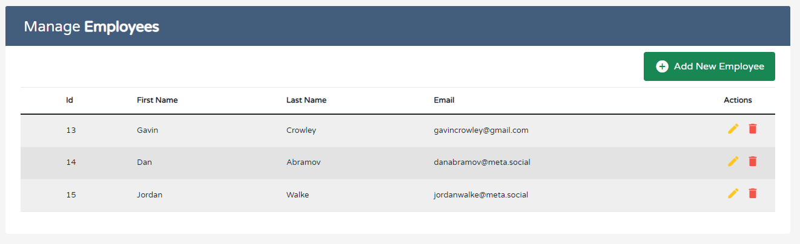

# Employee Manager

<h1 align="center">
   
  
</h1>

<h4 align="center">An app to store your Employee's details</h4>

## Features

* React.js frontend
* Java Spring Boot Backend
* MySQL database
* Hosted on AWS EC2, S3 and RDS
